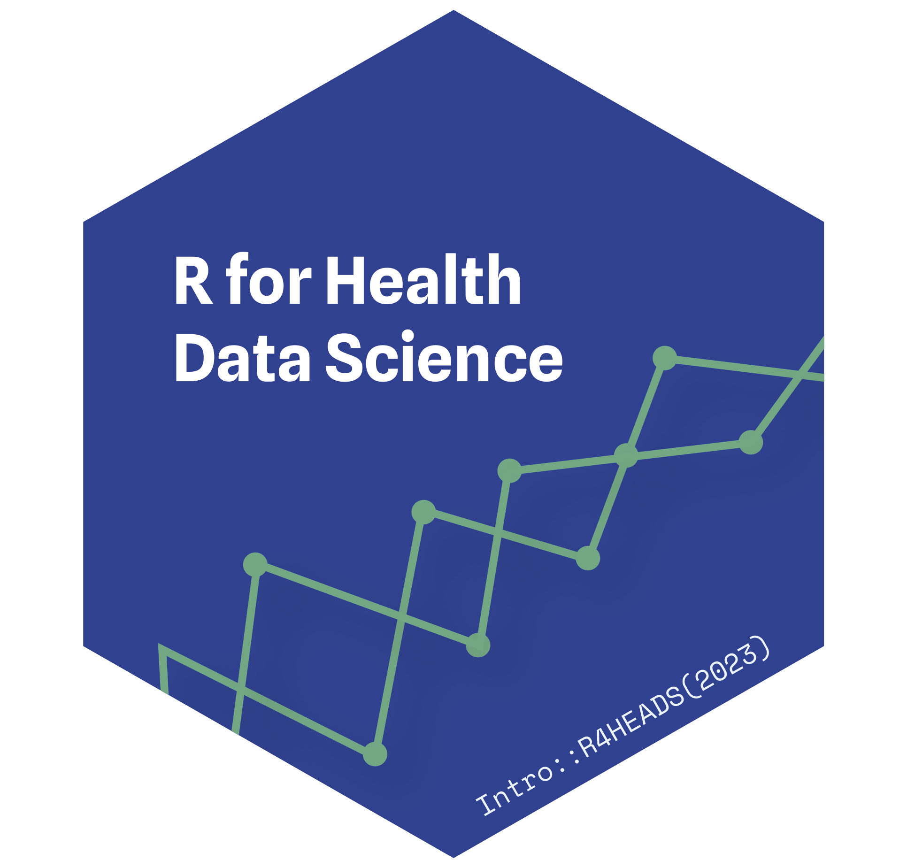
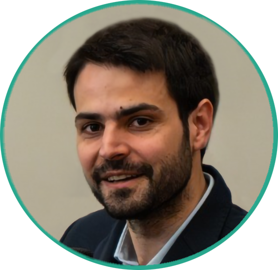

{style="float:right;padding: 0 0 0 10px;" fig-alt="Course Hex Logo" width="185"}

A course by Carlos Matos

------------------------------------------------------------------------

📆 &ensp;November 22-23 & 27-28, 2023\
⏰ &ensp;09:00–17:30\
🏨 &ensp;[ISPUP](https://maps.app.goo.gl/W2tGkJWvjdYtMoYF6)\

------------------------------------------------------------------------

# Course Overview

This hands-on training will provide an introductory overview of the basic tools for effective health data science with R, using the tidyverse collection of packages. 

You will learn, through hands-on exercises, how to import data to R, perform common data transformations and pre-processing, visualize, analyse, model and interactively report your results.

## Is this course for me?

This course is aimed at health professionals, researchers, data analysts, post-graduation students or anyone wanting to:

* Start using R as a tool for research or data science,
* Migrate to R from other software (e.g. Excel, Stata, SPSS),
* Expand their data analysis skillset with data cleaning, visualization and interactive reporting.

{style="float:right;padding: 0 0 5px 10px;" fig-alt="Headshot of the course instructor Cédric Scherer" width="165"}

# Instructor

Dr. Carlos Matos is a Public Health Medical Doctor. He started using R to monitor the COVID-19 pandemic, and never looked back. 
 
Since then he has used R regularly in the Health Observatory @ Public Health Department, Northern Region Health Administration, to monitor population health, and in a population health needs assessment for the Portuguese National Health Plan.
 
He is currently in the 2nd year of a Health Data Science PhD @ Faculty of Medicine, University of Porto, with a thesis focused on the usage of machine learning models to improve cancer outcomes.

&ensp;

